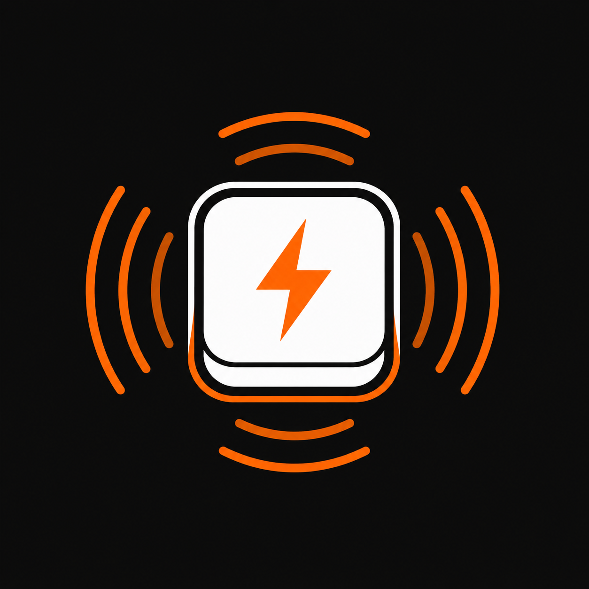

<p align="center">
  
</p>

<h1 align="center">⌨️ keyflash</h1>

<p align="center">
  <strong>Never miss an AI agent's response again.</strong><br>
  <em>Your MacBook keyboard backlight becomes your productivity radar.</em>
</p>

<p align="center">
  
  
  
</p>

<p align="center">
  
  
  
</p>

---

## ✨ Overview

**keyflash** is a macOS menu bar app that flashes your MacBook's **keyboard backlight** whenever your AI coding agent finishes a task. It wraps the agent's CLI under a pseudo-terminal, intelligently detects when a response is complete, and triggers a continuous keyboard glow that pulses until you interact — so you never need to stare at a terminal waiting.

Works with:

- 🤖 **Claude Code** (`claude`)
- 🔍 **OpenCode** (`opencode`)
- 🧑‍💻 **Aider** (`aider`)

---

## 🎥 What It Looks Like

| State | Behavior |
|---|---|
| 💤 **Idle** | Menu bar icon shows inactive. Keyboard at normal brightness. |
| ⚡ **Agent Working** | Nothing — you work while it thinks. |
| 🟠 **Task Complete!** | Keyboard backlight **pulses continuously** until you press a key or click. |
| ✅ **You Interact** | Pulse stops. Backlight returns to normal. |

> The flash is *continuous* — it keeps going until you acknowledge it, so you can walk away from your desk and see the glow from across the room. 🏃‍♂️💨

---

## ✨ Features

- 🚀 **Menu Bar App** — Lives in your menu bar, no dock icon, no distractions.
- 🔦 **Keyboard Backlight Pulse** — Continuous flash until you interact (key press, mouse click, or scroll).
- 🧠 **Smart Detection** — Watches for the prompt glyph (`❯`, `>` etc.) reappearing in the PTY output after real response content, using both an idle-gap heuristic and exact-prompt matching. Only fires after actual response output, never on startup, exit, or stray prompt markers.
- 🔌 **PTY Wrapper** — Wraps agents under a pseudo-terminal, properly forwarding `SIGWINCH` and terminal size so TUI apps render correctly.
- ⚙️ **Configurable** — Adjust pulse brightness, ramp-up/down speed, and enable/disable via a beautiful settings window.
- 🎨 **Liquid Glass UI** — Polished SwiftUI interface with orange accent theme.
- 🛠️ **One-Click Shell Hook** — "Install Shell Hook" in the menu bar adds `alias` entries for `claude`, `opencode`, and `aider` that route through `keyflash-run`.
- 🔄 **Launch at Login** — Optionally auto-start the menu bar app on login via `SMAppService`.
- 📝 **Debug Logging** — Everything logged to `/tmp/keyflash.log` for troubleshooting.

---

## 🖥️ Requirements

- **macOS 14 (Sonoma)** or later
- **Mac with a keyboard backlight** (MacBook Pro, MacBook Air, Magic Keyboard with backlight)
- **Xcode Command Line Tools** (for building from source)

---

## 📦 Installation

### 🔨 Build from Source (Recommended)

**Step 1: Install Xcode Command Line Tools**

```bash
xcode-select --install
```

**Step 2: Clone the repository**

```bash
git clone https://github.com/YOUR_USER/keyflash.git
cd keyflash
```

**Step 3: Build the app**

```bash
./Scripts/build-app.sh release
```

This will:
1. Compile all Swift targets with `swift build -c release`
2. Compile `mac-brightnessctl` from source (the Objective-C keyboard backlight driver)
3. Create `keyflash.app` bundle with all three binaries
4. Ad-hoc sign the app for local use

**Step 4: Run it**

```bash
open .build/release/keyflash.app
```

Or move it to `/Applications`:

```bash
cp -R .build/release/keyflash.app /Applications/
open /Applications/keyflash.app
```

### 📀 Build a DMG (Optional)

```bash
./Scripts/build-dmg.sh
```

Creates a distributable `.dmg` at `.build/release/keyflash.dmg` — great for sharing or AirDropping to another Mac.

---

## 🚀 Getting Started

### 1️⃣ Launch the App

After installation, run `keyflash.app`. You'll see a ⚡ lightning bolt icon in your menu bar.

> The app runs as an **accessory** (no dock icon) — it sits quietly in the menu bar.

### 2️⃣ Install the Shell Hook

Click the menu bar icon → **Install Shell Hook**. This adds these aliases to your `~/.zshrc`:

```bash
# >>> keyflash >>>
alias claude='/Applications/keyflash.app/Contents/MacOS/keyflash-run -- claude'
alias opencode='/Applications/keyflash.app/Contents/MacOS/keyflash-run -- opencode'
alias aider='/Applications/keyflash.app/Contents/MacOS/keyflash-run -- aider'
# <<< keyflash <<<
```

**Restart your terminal** (or run `source ~/.zshrc`).

> ⚠️ **TUI Note:** The old `keyflash-run` wrapper used subprocess spawning which broke TUI rendering. The current version uses `posix_spawnp()` with a real PTY and forwards `SIGWINCH` — so TUI apps like OpenCode and Claude Code fill your terminal correctly. If you still see a tiny TUI rendering, check [OPENCODE_TUI_FIX.md](OPENCODE_TUI_FIX.md) for known workarounds.

### 3️⃣ You're Done! 🎉

Now whenever you use `claude`, `opencode`, or `aider`, the keyboard backlight will flash when a task completes.

**Try it:**

```bash
claude "Write a quick Python script"
# ... Claude generates output ...
# 💥 Keyboard backlight flashes continuously!
# Press any key to stop the flash.
```

---

## ⚙️ Configuration

### Settings Window

Click the menu bar icon → **Settings…** to open the configuration panel:


| Setting | Default | Description |
|---|---|---|
| **Enable Backlight Pulse** | On | Master toggle for the keyboard flash feature |
| **Brightness** | 255 | Peak brightness during pulse (1–255) |
| **Ramp Up** | 150 ms | Time to reach peak brightness |
| **Ramp Down** | 150 ms | Time to fade back to normal |
| **Launch at Login** | Off | Auto-start keyflash when you log in |

### YAML Config File

Settings are stored at `~/.config/keyflash/config.yaml`. You can edit it directly:

```yaml
enabled: true
backlightEnabled: true
pulseRampUpMs: 150
pulseRampDownMs: 150
pulseFps: 30
pulseBrightness: 255
launchAtLogin: false
shouldAutoInstall: true
debugMode: false
```

---

## 🧪 Testing

### Test the backlight from the menu bar

Click the menu bar icon → **Test Flicker** to trigger a flash immediately (no agent needed).

### Test via CLI

```bash
keyflash-run --test-pulse
```

### Debug logging

All activity is logged to `/tmp/keyflash.log`. Check it for troubleshooting:

```bash
tail -f /tmp/keyflash.log
```

Enable `debugMode: true` in config for verbose prompt detection logging.

---

## 🏗️ Architecture

keyflash is composed of **three binaries** that work together:

```
┌─────────────────────────────────────────────────────────┐
│                    Terminal / Shell                       │
│  $ claude "write a server"                               │
│       │                                                  │
│       ▼                                                  │
│  keyflash-run -- claude "write a server"                 │
│       │                                                  │
│       ├── Spawns PTY (posix_spawnp)                      │
│       ├── Forwards stdin/stdout/stderr ↔ child           │
│       ├── Forwards SIGWINCH for TUI compatibility        │
│       ├── Monitors output for silence → detects done     │
│       │                                                  │
│       └── On task complete ──────┐                       │
│                                  │                       │
│                                  ▼                       │
│                  Unix Socket (/tmp/keyflash.sock)        │
│                                  │                       │
│                                  ▼                       │
│  keyflash.app (menu bar) ◄───────┘                       │
│       │                                                  │
│       ▼                                                  │
│  BacklightFlickerController                              │
│       │                                                  │
│       ▼                                                  │
│  mac-brightnessctl -f 99999 0.4 200                      │
│       │                                                  │
│       ▼                                                  │
│  🔦 Keyboard backlight flashes!                          │
│       │                                                  │
│       ◄── User presses key → flash stops                 │
└─────────────────────────────────────────────────────────┘
```

### Components

| Component | Language | Purpose |
|---|---|---|
| **keyflash** (app) | Swift / SwiftUI | Menu bar app — listens for events, shows settings UI, controls backlight flicker |
| **keyflash-run** | Swift / C (POSIX) | PTY wrapper CLI — spawns AI agents, detects task completion, sends notification |
| **mac-brightnessctl** | Objective-C | Low-level keyboard backlight control via private CoreBrightness APIs |

### Key Design Decisions

- **Unix sockets** for IPC (not `DistributedNotificationCenter`) — reliable for unsigned apps on macOS 26+.
- **PTY spawning** (`posix_openpt` + `posix_spawnp`) — proper TTY handling for TUI-based agents, with `poll()` I/O loop (not `select()`, which doesn't work well in Swift).
- **Output-gated prompt detection** — Watches for the prompt glyph (`❯`, `>`, `$`, `%`) reappearing in output after real response text (letters/digits) has been emitted. Only fires after actual agent output between prompts, never on startup, shutdown, or stray markers.
- **Continuous flash** — keeps flashing until user interaction, so the signal works even when you're away from the desk.
- **mac-brightnessctl** bundled inside `.app` — no external dependencies to install.

---

## 🛠️ Development

### Prerequisites

- Xcode 15+ or Xcode Command Line Tools
- macOS 14+

### Build for Development

```bash
./Scripts/build-app.sh debug
```

### Project Structure

```
keyflash/
├── Assets/                    # App icon and media assets
├── Package.swift              # Swift Package Manager manifest
├── Sources/
│   ├── keyflash/              # Menu bar app
│   │   ├── App.swift          # @main SwiftUI app, AppDelegate, BacklightFlickerController
│   │   ├── Config.swift       # YAML-backed config store
│   │   ├── SettingsWindow.swift  # Settings UI (SwiftUI)
│   │   ├── PulsePreview.swift # Animated pulse preview
│   │   ├── NotificationService.swift  # Unix socket server for task events
│   │   ├── LaunchAgentInstaller.swift  # Login item registration
│   │   └── ShellHookInstaller.swift    # ~/.zshrc alias installer
│   ├── keyflash-run/          # PTY wrapper CLI
│   │   ├── KeyflashRun.swift  # @main CLI (ArgumentParser)
│   │   ├── PTYSpawn.swift     # PTY creation + posix_spawnp + poll I/O loop
│   │   ├── PromptDetector.swift  # Silence-based task completion detection
│   │   └── NotifyClient.swift    # Unix socket client
│   └── KeyflashCore/          # Shared library
│       ├── Config.swift       # Config types + loader
│       ├── Backlight.swift    # mac-brightnessctl wrapper
│       └── Theme.swift        # Liquid Glass theme (colors, gradients, modifiers)
├── Scripts/
│   ├── build-app.sh           # Builds .app bundle
│   ├── build-dmg.sh           # Builds .dmg disk image
│   ├── mac-brightnessctl/     # Objective-C backlight control tool
│   │   ├── main.m             # CLI entry point
│   │   ├── BrightnessControl.{h,m}
│   │   ├── KeyboardBrightnessClient.h
│   │   ├── KeyboardManager.{h,m}
│   │   └── Makefile
│   └── keyflash-Info.plist
```

---

## 🧰 Troubleshooting

### 🔦 Keyboard doesn't flash

1. **Check if your Mac has a keyboard backlight** — Older MacBook models may not. Test with the brightness keys (`F5`/`F6` on Intel, Touch Bar on newer models).
2. **Check the app is running** — Look for the ⚡ icon in the menu bar.
3. **Check the backlight tool** — Run `keyflash-run --test-pulse` to test directly.
4. **Check logs** — `tail -f /tmp/keyflash.log` for error messages.
5. **Enable debug mode** — Add `debugMode: true` to `~/.config/keyflash/config.yaml`.

### 🪟 TUI renders in a tiny box

If Claude Code or OpenCode renders in a tiny corner of the terminal:

- This was caused by running through a non-PTY subprocess. The current `keyflash-run` uses `posix_spawnp()` with a proper PTY and should work correctly.
- Restart your terminal or re-source your shell config after upgrading.
- See [OPENCODE_TUI_FIX.md](OPENCODE_TUI_FIX.md) for detailed troubleshooting.

### 🔌 Shell hook not working

Run the install again from the menu bar → **Install Shell Hook**, then:

```bash
source ~/.zshrc
```

To verify:

```bash
which claude
# Should output: claude: aliased to /Applications/keyflash.app/Contents/MacOS/keyflash-run -- claude
```

---

## 🔄 Uninstalling

### Remove the shell hook

Open `~/.zshrc` and delete the `# >>> keyflash >>>` / `# <<< keyflash <<<` block.

### Remove the app

```bash
rm -rf /Applications/keyflash.app
```

### Remove config

```bash
rm -rf ~/.config/keyflash
```

---

## 📄 License

MIT — do whatever you want. Go build cool stuff. 🚀

---

<p align="center">
  <sub>Built with ❤️ and ☕ for developers who want to context-switch less and ship more.</sub>
</p>
