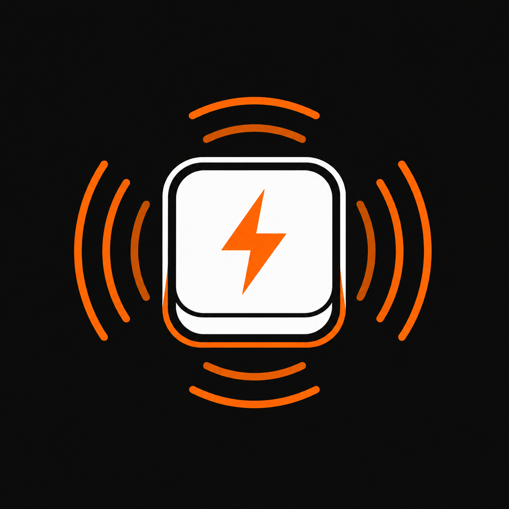

<p align="center">
  
</p>

<h1 align="center">⌨️ keyflash</h1>

<p align="center">
  <strong>Never miss an AI agent's response again.</strong><br>
  <em>Your MacBook keyboard backlight becomes your productivity radar.</em>
</p>

<p align="center">
  
  
  
</p>

<p align="center">
  
  
  
</p>

---

## ✨ Overview

**keyflash** is a macOS menu bar app that flashes your MacBook's **keyboard backlight** whenever your AI coding agent finishes a task. Claude Code and OpenCode tell keyflash *exactly* when they finish through their own hook systems (no output guessing), and keyflash triggers a continuous keyboard glow that pulses until you interact — so you never need to stare at a terminal waiting.

Works with:

- 🤖 **Claude Code** (`claude`)
- 🔍 **OpenCode** (`opencode`)
- 🧑‍💻 **Aider** (`aider`)

---

## 🎥 What It Looks Like

| State | Behavior |
|---|---|
| 💤 **Idle** | Menu bar icon shows inactive. Keyboard at normal brightness. |
| ⚡ **Agent Working** | Nothing — you work while it thinks. |
| 🟠 **Task Complete!** | Keyboard backlight **pulses continuously** until you press a key or click. |
| ✅ **You Interact** | Pulse stops. Backlight returns to normal. |

> The flash is *continuous* — it keeps going until you acknowledge it, so you can walk away from your desk and see the glow from across the room. 🏃‍♂️💨

---

## ✨ Features

- 🚀 **Menu Bar App** — Lives in your menu bar, no dock icon, no distractions.
- 🔦 **Keyboard Backlight Pulse** — Continuous flash until you interact (key press, mouse click, or scroll).
- 🎯 **Exact Detection** — Uses Claude Code's `Stop` / `Notification` hooks and an OpenCode plugin (`session.idle`, `permission.asked`, `question.asked`). It fires when the agent finishes its turn or is blocked waiting on you. It never fires for sub-agents, while you type, or on startup.
- ♻️ **Self-Healing Hooks** — The app (re)installs the hooks on every launch, so they keep pointing at the right `keyflash-run` even after you move or update the app.
- 💡 **Restores Your Brightness** — The backlight goes back to exactly the level you had before the flash.
- 🛡️ **Always Stops** — Stops on key press, click or scroll (no special permission needed), from **Stop Flashing** in the menu, and after a 30-minute safety cap.
- 🔌 **PTY Wrapper (aider)** — For agents without hooks, `keyflash-run -- aider` wraps the CLI under a pseudo-terminal and detects a finished response after you press Enter.
- 🎨 **Liquid Glass UI** — Polished SwiftUI interface with orange accent theme.
- 🛠️ **One-Click Setup** — **Install Agent Hooks** in the menu bar sets up Claude Code, OpenCode and the `aider` wrapper.
- 🔄 **Launch at Login** — Optionally auto-start the menu bar app on login via `SMAppService`.
- 📝 **Debug Logging** — Everything logged to `~/Library/Logs/keyflash.log` (rotated at 1 MB) for troubleshooting.

---

## 🖥️ Requirements

- **macOS 14 (Sonoma)** or later
- **MacBook with a backlit built-in keyboard** (MacBook Pro / MacBook Air; Apple Silicon or Intel)
- **Xcode Command Line Tools** (for building from source)

---

## 📦 Installation

### 🔨 Build from Source (Recommended)

**Step 1: Install Xcode Command Line Tools**

```bash
xcode-select --install
```

**Step 2: Clone the repository**

```bash
git clone https://github.com/Shalin-Shah-2002/keyflash.git
cd keyflash
```

**Step 3: Build the app**

```bash
./Scripts/build-app.sh release
```

This will:
1. Compile all Swift targets with `swift build -c release`
2. Compile `mac-brightnessctl` from source (the Objective-C keyboard backlight driver)
3. Create `keyflash.app` bundle with all three binaries
4. Ad-hoc sign the app for local use

**Step 4: Run it**

```bash
open .build/release/keyflash.app
```

Or move it to `/Applications`:

```bash
cp -R .build/release/keyflash.app /Applications/
open /Applications/keyflash.app
```

### ⬇️ Downloaded the DMG from Releases?

The app is ad-hoc signed, not notarized, so macOS may say it "is damaged" or "can't be opened". After dragging it to Applications, run:

```bash
xattr -dr com.apple.quarantine /Applications/keyflash.app
```

### 📀 Build a DMG (Optional)

```bash
./Scripts/build-dmg.sh
```

Creates a distributable `.dmg` at `.build/release/keyflash.dmg` — great for sharing or AirDropping to another Mac.

---

## 🚀 Getting Started

### 1️⃣ Launch the App

After installation, run `keyflash.app`. You'll see a ⚡ lightning bolt icon in your menu bar.

> The app runs as an **accessory** (no dock icon) — it sits quietly in the menu bar.

### 2️⃣ Agent Hooks (automatic)

On launch, keyflash installs completion hooks for you. You can also click the menu bar icon → **Install Agent Hooks**, or run:

```bash
/Applications/keyflash.app/Contents/MacOS/keyflash-run --install-hooks
```

This sets up:

| Agent | What gets installed | Flashes when |
|---|---|---|
| **Claude Code** | `Stop` + `Notification` hooks in `~/.claude/settings.json` (your other settings are preserved; the previous file is saved as `settings.json.keyflash-backup`) | Claude finishes its turn, or asks for permission / MCP input |
| **OpenCode** | Plugin at `~/.config/opencode/plugins/keyflash.js` | The main session goes idle, or it asks for permission / asks you a question (sub-agent sessions are ignored) |
| **aider** | `aider` shell function in your rc file that runs it through `keyflash-run` | A response finishes after you press Enter |

**Restart any running `claude` / `opencode` sessions** so they load the hooks. You run them exactly as before, with no aliases needed. (Old `claude`/`opencode` aliases from earlier keyflash versions are removed when you click **Install Agent Hooks**. If you keep them, they're harmless.)

### 3️⃣ You're Done! 🎉

**Try it:**

```bash
claude "Write a quick Python script"
# ... Claude works ...
# 💥 Keyboard backlight flashes the moment Claude finishes!
# Press any key, click or scroll to stop the flash.
```

> The menu bar app must be running to flash. Turn on **Launch at Login** in Settings so it always is.

---

## ⚙️ Configuration

### Settings Window

Click the menu bar icon → **Settings…** to open the configuration panel:

| Setting | Default | Description |
|---|---|---|
| **Flash when an agent finishes** | On | Master toggle for the keyboard flash |
| **Install / Repair Agent Hooks** | — | Shows whether Claude Code / OpenCode hooks are installed and (re)installs them |
| **Launch at Login** | Off | Auto-start keyflash when you log in |

### YAML Config File

Settings are stored at `~/.config/keyflash/config.yaml`. You can edit it directly:

```yaml
enabled: true
backlightEnabled: true
pulseRampUpMs: 150
pulseRampDownMs: 150
pulseFps: 30
pulseBrightness: 255
launchAtLogin: false
shouldAutoInstall: true
debugMode: false
```

---

## 🧪 Testing

### Test the backlight from the menu bar

Click the menu bar icon → **Test Flicker** to trigger a flash immediately (no agent needed).

### Test via CLI

```bash
keyflash-run --test-pulse
```

### Debug logging

All activity is logged to `~/Library/Logs/keyflash.log`. Check it for troubleshooting:

```bash
tail -f ~/Library/Logs/keyflash.log
```

Enable `debugMode: true` in config (or pass `--debug`) for verbose prompt detection logging in the `keyflash-run` wrapper.

### Simulate an agent finishing

```bash
/Applications/keyflash.app/Contents/MacOS/keyflash-run --notify claude
```

This is exactly what the Claude Code / OpenCode hooks run.

---

## 🏗️ Architecture

```
  Claude Code ── Stop / Notification hook ──┐
  OpenCode ───── keyflash.js plugin ────────┤──▶ keyflash-run --notify <agent>
  aider ──────── keyflash-run -- aider ─────┘          │
                 (PTY wrapper, Enter + silence)         │
                                                        ▼
                                     Unix socket (~/Library/Application Support/keyflash/keyflash.sock, 0600)
                                                        │
                                                        ▼
                                          keyflash.app (menu bar)
                                                        │
                           BacklightFlickerController ──┤
                             • saves current brightness │
                             • mac-brightnessctl -f …   ▼
                                         🔦 keyboard backlight flashes
                                                        │
                   key / click / scroll ────────────────┘  stop + restore brightness
```

### Components

| Component | Language | Purpose |
|---|---|---|
| **keyflash** (app) | Swift / SwiftUI | Menu bar app — listens for events, shows settings UI, controls backlight flicker |
| **keyflash-run** | Swift / C (POSIX) | `--notify` endpoint for agent hooks, `--install-hooks`, and a PTY wrapper for agents without hooks |
| **mac-brightnessctl** | Objective-C | Low-level keyboard backlight control via private CoreBrightness APIs |

### Key Design Decisions

- **Unix sockets** for IPC (not `DistributedNotificationCenter`) — reliable for unsigned apps on macOS 26+. The socket and log live in your home directory (not shared `/tmp`), so other local users can't hijack or read them.
- **PTY spawning** (`posix_openpt` + `posix_spawn`) — the wrapped agent gets a real controlling terminal (via a tiny exec helper doing `setsid` + `TIOCSCTTY`), so Ctrl-C and git/ssh/sudo prompts work; your environment and exit code pass through untouched.
- **Native agent hooks over heuristics** — Claude Code and OpenCode already know exactly when a turn ends. Terminal-output guessing can't be made reliable (typing pauses, spinners, permission prompts), so it's only used as a fallback for aider.
- **Two input detectors** — A Quartz event tap (instant, needs Input Monitoring) plus polling `CGEventSource` idle time (no permission). The flash always stops.
- **Continuous flash** — keeps flashing until user interaction, so the signal works even when you're away from the desk.
- **mac-brightnessctl** bundled inside `.app` — no external dependencies to install.

---

## 🛠️ Development

### Prerequisites

- Xcode 15+ or Xcode Command Line Tools
- macOS 14+

### Build for Development

```bash
./Scripts/build-app.sh debug
```

### Run the Tests

```bash
swift test
```

The core (`KeyflashCore`) and `keyflash-run` are plain Foundation/POSIX code, so the tests also run on Linux (`docker run --rm -v "$PWD":/src -w /src swift:6.0-noble swift test`). CI runs them on macOS and Linux.

### Project Structure

```
keyflash/
├── Assets/                    # App icon and media assets
├── Package.swift              # Swift Package Manager manifest
├── Sources/
│   ├── keyflash/              # Menu bar app (macOS only)
│   │   ├── App.swift          # @main SwiftUI app, AppDelegate, BacklightFlickerController
│   │   ├── Config.swift       # ConfigStore (writes config.yaml)
│   │   ├── SettingsWindow.swift  # Settings UI (SwiftUI)
│   │   ├── PulsePreview.swift # Animated pulse preview
│   │   ├── Theme.swift        # Liquid Glass theme (colors, gradients, modifiers)
│   │   └── LaunchAgentInstaller.swift  # Login item (SMAppService)
│   ├── keyflash-run/          # CLI: --notify, --install-hooks, PTY wrapper
│   │   └── KeyflashRun.swift
│   └── KeyflashCore/          # Shared, Foundation-only library
│       ├── AgentHooks.swift   # Claude Code / OpenCode hook installer
│       ├── NotifySocket.swift # Unix socket client + server
│       ├── PTYSpawn.swift     # PTY + posix_spawn + poll I/O loop
│       ├── PromptDetector.swift  # Enter + silence detection (fallback for aider)
│       ├── ShellHookInstaller.swift  # aider wrapper installer (rc file)
│       ├── Backlight.swift    # mac-brightnessctl wrapper
│       ├── Config.swift       # Config types + loader
│       └── Log.swift          # Paths + logging
├── Tests/KeyflashCoreTests/   # XCTest suite (macOS + Linux)
├── Scripts/
│   ├── build-app.sh           # Builds universal .app bundle
│   ├── build-dmg.sh           # Builds .dmg disk image
│   ├── mac-brightnessctl/     # Objective-C backlight control tool
│   └── keyflash-Info.plist
```

---

## 🧰 Troubleshooting

### 🔦 Keyboard doesn't flash

1. **Check the app is running.** Look for the ⚡ icon in the menu bar, and turn on **Launch at Login**.
2. **Check the hooks.** Open Settings → **Agents** (both should say ✓), or run `keyflash-run --install-hooks`. Then **restart** your `claude` / `opencode` session.
3. **Simulate a finish.** Run `keyflash-run --notify claude`. If this flashes, the hooks are the problem; if it doesn't, it's the app or the backlight.
4. **Check the backlight tool.** Run `keyflash-run --test-pulse`, and check that your Mac has a keyboard backlight.
5. **Check the logs.** Run `tail -f ~/Library/Logs/keyflash.log`.

### 🛑 Flash doesn't stop

It stops on any key press, click or scroll. You can also use menu bar → **Stop Flashing**, and it stops by itself after 30 minutes. Your previous brightness is restored.

### 🪟 TUI renders in a tiny box

Claude Code and OpenCode no longer run through a wrapper, so this can't happen to them. If you still have old keyflash `alias claude=…` / `alias opencode=…` lines, click **Install Agent Hooks** to remove them, then open a new terminal.

For the `aider` wrapper, the terminal size is copied at start and on every resize (`SIGWINCH`).

### 🔌 Claude Code hook shows an error

If Claude Code reports a hook error, the app was probably moved. Launch it from its new location (it re-installs the hooks automatically), or run `keyflash-run --install-hooks` from there.

---

## 🔄 Uninstalling

### Remove the hooks

```bash
/Applications/keyflash.app/Contents/MacOS/keyflash-run --uninstall-hooks
```

Then delete the `# >>> keyflash >>>` / `# <<< keyflash <<<` block from your shell rc file (only present if you use the aider wrapper). Set `shouldAutoInstall: false` in the config to stop the app from re-adding hooks on launch.

### Remove the app

```bash
rm -rf /Applications/keyflash.app
```

### Remove config

```bash
rm -rf ~/.config/keyflash
```

---

## 📄 License

MIT — do whatever you want. Go build cool stuff. 🚀

---

<p align="center">
  <sub>Built with ❤️ and ☕ for developers who want to context-switch less and ship more.</sub>
</p>
